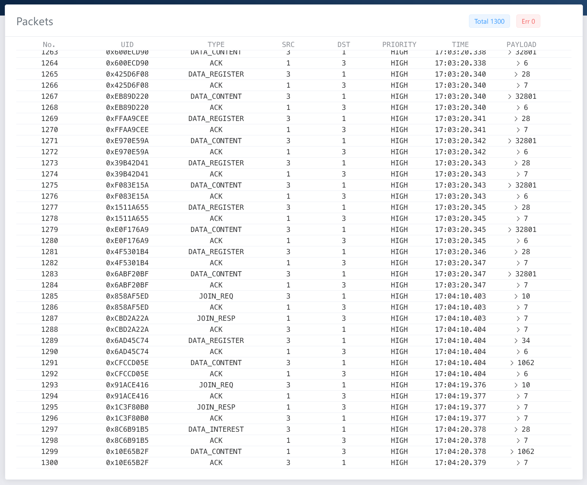

# Real-Time Data Exchange (RTDEX)

A real-time data exchange protocol and library inspired by Named-Data Networking (NDN) and IEEE 802.1Qbv Time-aware Shaper (TAS).

## Features

- Hierarchical name-based data access
- In-network data caching and async data transfer
- Time-aware priority queues for bounded latency
- Protocol Buffer integration
- Flexible session management and housekeeping
- Data chunking and checksum

## Architecture

```mermaid
graph BT
    subgraph Server[Engine]
        S_UDPSocket[UDP Socket]
        S_ProtoBuf[Protobuf]
        S_Cache[In-Network Cache]

        subgraph S_SessionMgr[Session Manager]
            subgraph S_Session[Client Session i]
                S_PriorityQueues[Priority Queues]
                S_TimeAwareScheduler[Time-Aware Scheduler]
            end
        end

        S_SlotMgr[Slot Manager]
        S_WebServer[Web Server]
        S_WebUI[Web UI]
    end

    subgraph Publisher[Publisher client]
        P_UDPSocket[UDP Socket]
        P_ProtoBuf[Protobuf]
        P_DataProcessing[Data Processing]
        P_PublishLogic[Publish Logic]
    end

    subgraph Subscriber[Subscriber client]
        Sub_UDPSocket[UDP Socket]
        Sub_ProtoBuf[Protobuf]
        Sub_DataProcessing[Data Processing]
        Sub_SubscribeLogic[Subscribe Logic]
    end

    %% Connections
    P_PublishLogic --> P_DataProcessing
    P_DataProcessing <--> P_ProtoBuf
    P_ProtoBuf <--> P_UDPSocket
    P_UDPSocket <-->|UDP| S_UDPSocket

    Sub_SubscribeLogic --> Sub_DataProcessing
    Sub_DataProcessing <--> Sub_ProtoBuf
    Sub_ProtoBuf <--> Sub_UDPSocket
    Sub_UDPSocket <-->|UDP| S_UDPSocket

    S_UDPSocket <--> S_ProtoBuf
    S_ProtoBuf <--> S_Session
    S_TimeAwareScheduler --> S_PriorityQueues
    S_SlotMgr --> S_TimeAwareScheduler

    S_ProtoBuf <--> S_Cache

    S_Cache --> S_WebServer
    S_SessionMgr --> S_WebServer

    S_WebServer <-- WebSocket --> S_WebUI
```

## Usage

Go server and client:

```go
package main

import (
	"crypto/rand"
	"fmt"
	"time"

	"github.com/AmyangXYZ/rtdex"
)

func main() {
	engine := rtdex.NewEngine(rtdex.DefaultConfig)
	go engine.Start()
	time.Sleep(1 * time.Second)

	client := rtdex.NewClient(3, "namespace-A", rtdex.DefaultConfig)
	client.Connect()

	data := make([]byte, 1024*1024)
	rand.Read(data)

	client.Put("/data/test", data, 10)

	if data, err := client.Get("/data/test"); err != nil {
		fmt.Println(err)
	} else {
		fmt.Printf("Received data: %d bytes\n", len(data))
	}

	client.Disconnect()
	// go func() {
	// 	for pkt := range engine.PacketSniffer().Stream() {
	// 		fmt.Println(pkt)
	// 	}
	// }()
	go engine.Stop()
	select {}
}

```

Python client API:

```python
api = RTDEX_API(3, "/api/test", verbose=True)
api.connect(123)
api.put("/data/test", b"Hello, World!", 100)
api.get("/data/test", timeout=5.0)
api.disconnect()
```




## License

MIT
